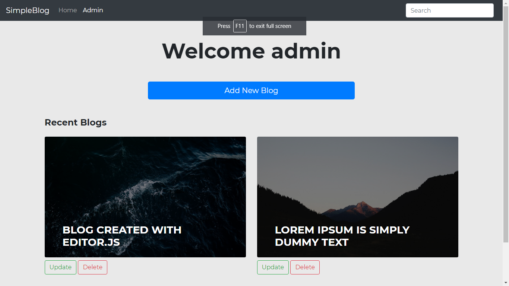

# Blog Application

A blog application created with Editor.js, Node.js, Express.js, PostgreSQL & Sequelize ORM

Node modules used
  - Express.js
  - Sequelize 
  - pg-hstore
  - pg
  - Body-Parser

Node modules used for testing
  - Jest.js
  - SuperTest

### Running application

##### Setting up Database:

Create new database with name ```blogdb```

This repo includes Postgresql file. Import these files in your pgAdmin note: "Select format 'Directory', select Postgresql file directory in filename and select a user in rolename then click on Restore". 

##### If any issue occur create DB & Table manually

Table name : blogs


Table name : comments


Now link blogid(comments) with id(blogs)


Now change username and password in ```blog-node/Backend/config/database.js  ```

Database setup is done!!

Moving on backend

```sh
$ cd blog-node/Backend
$ npm install
```

For production environments...

```sh
$ npm run start
```

For development environments...

```sh
$ npm run dev
```
Moving on frontend
```sh
$ cd ../Frontend
```
Open index.html file with your favorite browser or with live server.
Done!!

### Running Test

```sh
$ cd Triangle-checker/Backend/
$ jest
```

### Few other information about project

This application includes 2 section
- User
- Admin

In the user section, a user can view the blog, create, delete & update comment.

In admin section, the admin can create, update, delete blogs and admin can only the delete comment.

This blog application also supports images and Youtube video you just need to paste URL in the editor

### Few screenshots





